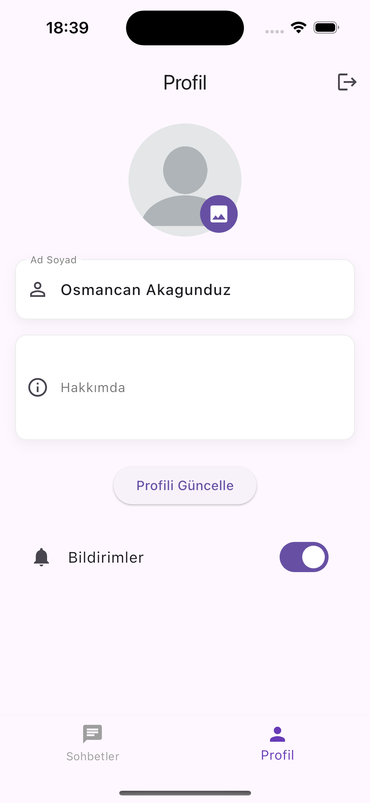

# ChatFlow - Real-Time Messaging Application

## 🚀 About The Project

ChatFlow is a modern and user-friendly real-time messaging application. Built with Flutter framework, it provides seamless functionality across both iOS and Android platforms.

## 📱 Screenshots

<div align="center">
  
  
  
  
</div>

## ✨ Features

### 🔐 Authentication
- Secure session management with JWT
- User registration and login
- Secure password storage

### 💬 Real-Time Chat
- Instant messaging with Firebase Realtime Database
- Typing indicators
- Message read/unread status
- Last seen feature

### 🔔 Notifications
- Firebase Cloud Messaging (FCM) integration
- Customizable notification settings
- In-app notification management

### 👤 User Profile
- Profile creation and editing
- Profile picture upload with Firebase Storage
- User settings management

## 🛠 Technical Features

- Clean Architecture principles
- State management with BLoC pattern
- Firebase services integration
- Comprehensive error handling
- Unit and widget tests

## 🔧 Installation

1. Prerequisites:
   - Flutter SDK (latest version)
   - Dart SDK (latest version)
   - Android Studio / VS Code
   - Firebase account

2. Clone the project:
   ```bash
   git clone [repo-url]
   cd chat_flow
   ```

3. Install dependencies:
   ```bash
   flutter pub get
   ```

4. Firebase configuration:
   - Create a new project in Firebase Console
   - Add google-services.json and GoogleService-Info.plist files to respective directories
   - Complete Firebase setup steps

5. Run the application:
   ```bash
   flutter run
   ```

## 📱 Supported Platforms

- iOS 11.0 and above
- Android 5.0 (API level 21) and above

## 🧪 Tests

```bash
flutter test
```

## 📚 API Documentation

For API endpoints and usage, please refer to [API.md](API.md).

## 🤝 Contributing

1. Fork the project
2. Create your feature branch (`git checkout -b feature/amazing-feature`)
3. Commit your changes (`git commit -m 'feat: Add amazing feature'`)
4. Push to the branch (`git push origin feature/amazing-feature`)
5. Open a Pull Request

## 📄 License

This project is licensed under the [MIT](LICENSE) License.

## 📸 Directory Structure for Screenshots

```
screenshots/
├── login.png
├── chat_list.png
├── chat_detail.png
└── profile.png
```

Note: Please add your application screenshots to the `screenshots` directory following the structure above.