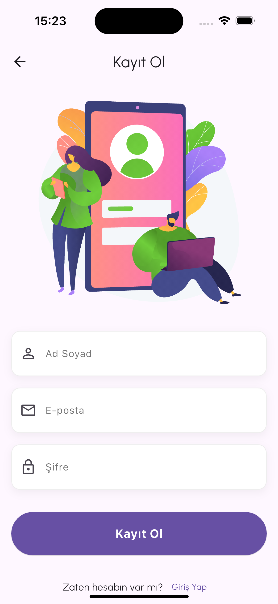
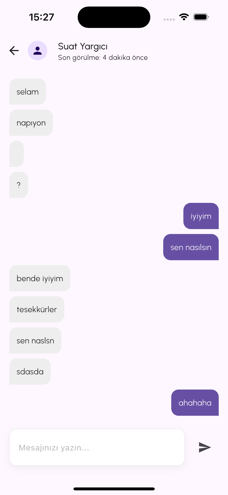
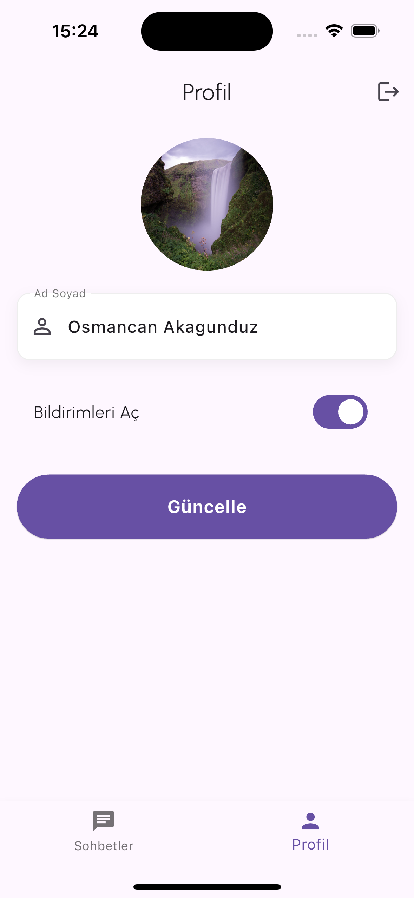

# ChatFlow - Real-Time Messaging Application

## 🚀 About The Project

ChatFlow is a modern and user-friendly real-time messaging application. Built with Flutter framework, it provides seamless functionality across both iOS and Android platforms.

## 📱 Screenshots

<div align="center">
 <table>
  <tr>
    <td align="center">
      
      <br><em>Login View</em>
    </td>
    <td align="center">
      
      <br><em>Register View</em>
    </td>
     <td align="center">
      
      <br><em>Home View</em>
    </td>
  </tr>
  <tr>
    <td align="center">
      
      <br><em>Chat View</em>
    </td>
    <td align="center">
      
      <br><em>Users View</em>
    </td>
     <td align="center">
      
      <br><em>Profile View</em>
    </td>
  </tr>
</table>
</div>

## 📂 Project Structure

```
lib/
├── core/
│   ├── base/
│   │   ├── model/              # Base model interfaces
│   │   └── view/               # Base view classes
│   ├── bloc/                   # Global BLoC states
│   ├── constants/              # App constants
│   ├── init/
│   │   ├── network/           # Network layer management
│   │   ├── cache/             # Local storage management
│   │   ├── notification/      # Push notification setup
│   │   └── theme/             # App theme configuration
│   ├── models/                # Data models
│   └── service/               # API services
├── feature/
│   ├── auth/                  # Authentication feature
│   │   ├── login/
│   │   └── register/
│   ├── chat/                  # Chat feature
│   ├── home/                  # Home feature
│   └── profile/               # Profile feature
└── main.dart
```

## 🔍 Case Studies

### 1. Network Layer Implementation

The project includes a robust network layer implementation with the following features:

#### Network Manager
- Singleton pattern for network operations
- Generic response handling
- Type-safe API calls
- Automatic error handling

```dart
Future<R?> send<T extends INetworkModel<T>, R>({
  required String path,
  required RequestType type,
  required T parseModel,
  Map<String, dynamic>? queryParameters,
  Map<String, dynamic>? data,
})
```

#### Base Network Model
- Generic base model for all network responses
- Type-safe JSON parsing
```dart
abstract class INetworkModel<T> {
  T fromJson(Map<String, dynamic> json);
  Map<String, dynamic> toJson();
}
```

### 2. Service Layer Implementation

Example service implementation showing CRUD operations:

```dart
abstract class IPostService {
  Future<List<PostModel>?> getPosts();
  Future<PostModel?> getPost(int id);
  Future<PostModel?> createPost(String title, String body, int userId);
  Future<PostModel?> updatePost(int id, String title, String body);
  Future<bool> deletePost(int id);
}
```

## ✨ Features

### 🔐 Authentication

- Secure session management with JWT
- User registration and login
- Secure password storage

### 💬 Real-Time Chat

- Instant messaging with Firebase Realtime Database
- Typing indicators
- Message read/unread status
- Last seen feature

### 🔔 Notifications

- Firebase Cloud Messaging (FCM) integration
- Customizable notification settings
- In-app notification management

### 👤 User Profile

- Profile creation and editing
- Profile picture upload with Firebase Storage
- User settings management

## 🛠 Technical Features

- Clean Architecture principles
- State management with BLoC pattern
- Firebase services integration
- Comprehensive error handling
- Unit and widget tests
- Generic network layer
- Type-safe API calls

## 🔧 Installation

1. Prerequisites:

   - Flutter SDK (latest version)
   - Dart SDK (latest version)
   - Android Studio / VS Code
   - Firebase account

2. Clone the project:

   ```bash
   git clone [repo-url]
   cd chat_flow
   ```

3. Install dependencies:

   ```bash
   flutter pub get
   ```

4. Configure Firebase:
   - Add your `google-services.json` for Android
   - Add your `GoogleService-Info.plist` for iOS

5. Run the app:
   ```bash
   flutter run
   ```

## 🧪 Testing

Run tests using:
```bash
flutter test
```

## 📚 Documentation

For detailed documentation about the implementation:
- [Network Layer](docs/network.md)
- [Authentication](docs/auth.md)
- [Real-time Features](docs/realtime.md)
- [State Management](docs/state.md)

## 📱 Supported Platforms

- iOS 11.0 and above
- Android 5.0 (API level 21) and above

## 🤝 Contributing

1. Fork the project
2. Create your feature branch (`git checkout -b feature/amazing-feature`)
3. Commit your changes (`git commit -m 'feat: Add amazing feature'`)
4. Push to the branch (`git push origin feature/amazing-feature`)
5. Open a Pull Request

## 📄 License

This project is licensed under the [MIT](LICENSE) License.

## 📸 Directory Structure for Screenshots

```
screenshots/
├── login.png
├── chat_list.png
├── chat_detail.png
└── profile.png
```

Note: Please add your application screenshots to the `screenshots` directory following the structure above.
